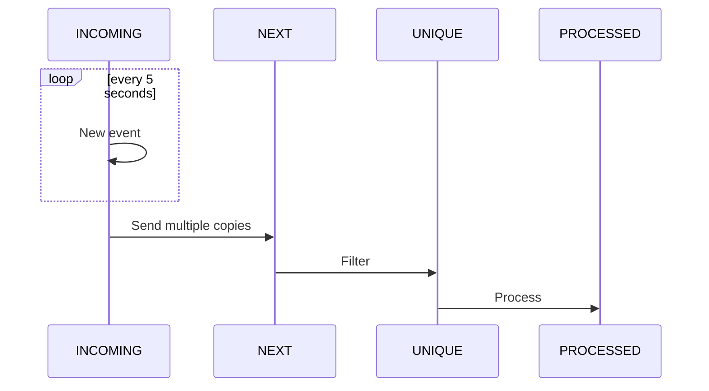

# JMS Camel
Experiment to work with [Camel](https://camel.apache.org/), 
[Spring Boot](https://spring.io/projects/spring-boot) and [JMS](https://activemq.apache.org/components/artemis/) and filter all repeating JMS messages.

## Working

No time is spend in the source code to prevent hardcoded queue names, etc.

## Running the Application

Follow these steps to get the application up and running:

1. **Start the JMS Queue**:
    - Use the provided `docker-compose` file located in the `environment/docker` directory to initialize the JMS queue.

2. **Launch the Application**:
    - Start the application by running the `JmsCamelApplication` class.

3. **Access the Redis Database**:
    - Use the Redis GUI available at [http://localhost:5540/](http://localhost:5540/) to interact with the Redis database.

4. **Connect to the JMS Provider**:
    - Access the JMS Management interface at [http://localhost:8161/](http://localhost:8161/) using the credentials `CNL/CNL`.
