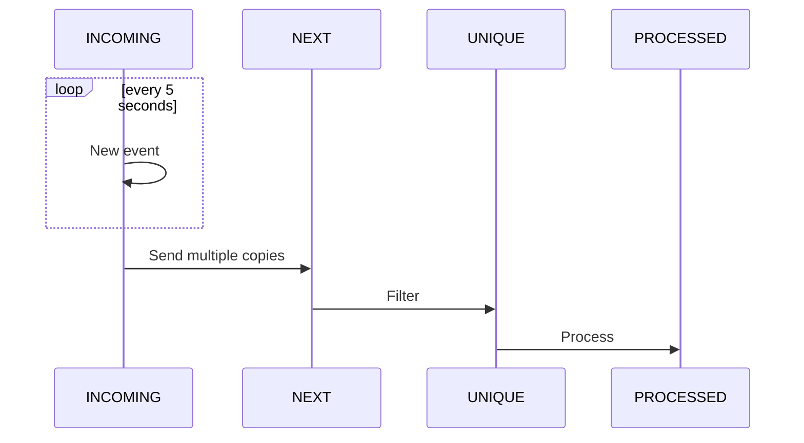

# JMS Camel
Experiment to work with [Camel](https://camel.apache.org/), 
[Spring Boot](https://spring.io/projects/spring-boot) and [JMS](https://activemq.apache.org/components/artemis/) and filter all repeating JMS messages.

## Working

No time is spend in the source code to prevent hardcoded queue names, etc.

## Run
- Start JMS queue with docker-compose file (*environment/docker* directory)
- start application with class 'JmsCamelApplication'.
- [Redis GUI](http://localhost:5540/) to access the Redis database.
- [JMS Management](http://localhost:8161/) (CNL/CNL) to connect to the JMS provider