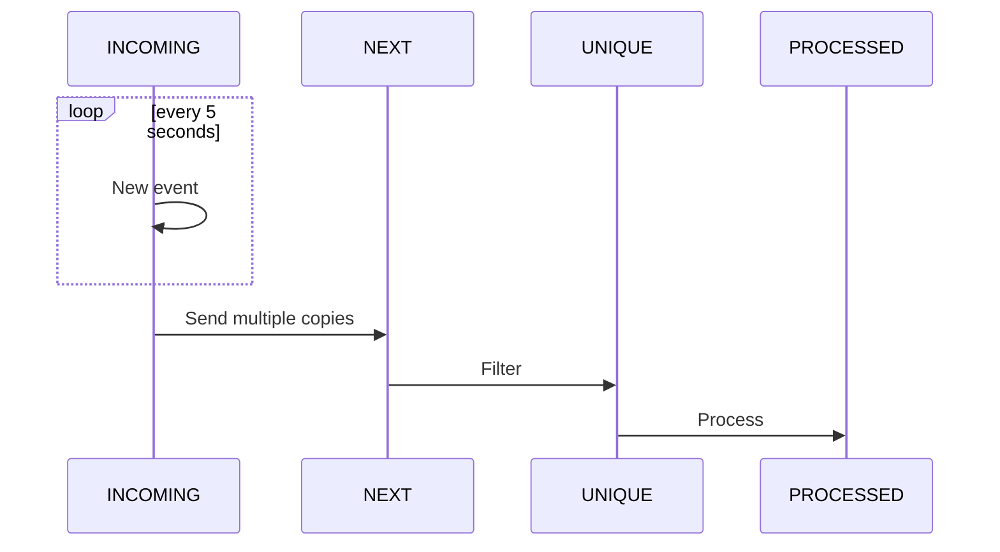
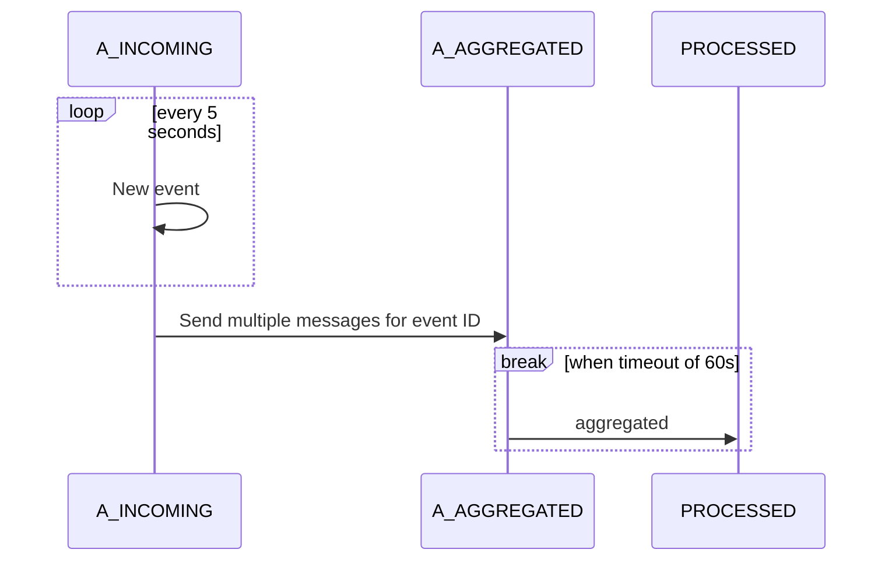

# JMS Camel
Experiment to work with [Camel](https://camel.apache.org/), 
[Spring Boot](https://spring.io/projects/spring-boot) and [JMS](https://activemq.apache.org/components/artemis/) and filter all repeating JMS messages.

In the source code, designed exclusively for demonstration purposes, no effort is made to avoid hard coding queue names and similar configurations.
## Working
### idempotent Receiver
Pattern according top [Idempotent Receiver](https://www.enterpriseintegrationpatterns.com/patterns/messaging/IdempotentReceiver.html) 
implemented in class *UniqueMessageRoute*.

### Aggregator
Pattern according top [Aggregator](https://www.enterpriseintegrationpatterns.com/patterns/messaging/Aggregator.html) 
implemented in class *AggregateMessageRoute*.

## Running the Application

Follow these steps to get the application up and running:

1. **Start the Environment**:
    - Use the provided `docker-compose` file located in the `environment/docker` directory to initialize the environment.

1. **Access the Redis Database**:
    - Use the Redis GUI available at [http://localhost:5540/](http://localhost:5540/) to interact with the Redis database.

1. **Connect to the JMS Provider**:
    - Access the JMS Management interface at [http://localhost:8161/](http://localhost:8161/) using the credentials `CNL/CNL`.

1. The logging of the **App** container shows the progress as well.

## Configuration

| Configuration                       | Description                                |        Default |
|-------------------------------------|--------------------------------------------|---------------:|
| jc.aggregate.enabled                | Aggregate route enabled                    |           true |
| jc.aggregate.redis.endpoint         | endpoint of Redis DB                       | 127.0.0.1:6379 |
| jc.aggregate.timer.period           | timer for aggregate test messages (ms)     |           5000 |
| jc.aggregate.completion.timeout.sec | timer for aggregate completion timeout (s) |             60 |
| jc.aggregate.range.start            | Minimum number of messages per ID          |              5 |
| jc.aggregate.range.end              | Maximum number of messages per ID          |             10 |
| jc.unique.enabled                   | Unique route enabled                       |           true |
| jc.unique.redis.expiry              | timer for unique messages expiry (s)       |             60 |
| jc.unique.timer.period              | timer for unique test messages (ms)        |           5000 |

## Known Problems

### Issues Encountered with Apache Camel/Spring 4.5.0
While attempting to integrate Apache Camel/Spring 4.5.0, we encountered the following issues:

#### 1. Class Compatibility Issue
- The `RedisStringIdempotentRepository` class is not recognized in version 4.5.0. For more details, refer to the [Apache Camel 4.X Upgrade Guide](https://camel.apache.org/manual/camel-4x-upgrade-guide-4_5.html).

#### 2. Connection Issues with Redis
- After switching to `SpringRedisStringIdempotentRepository`, we experienced problems establishing a connection to Redis. These issues do not occur when connecting to `localhost` outside the context of a container.

#### Current Status
- The configuration of the Redis connection remains problematic, and the cause is unclear. Further investigation is required to resolve these connectivity issues.
